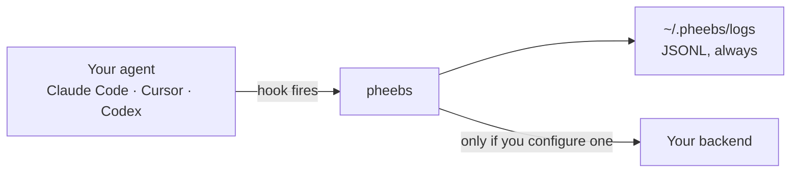

<div>
  <picture>
    <source media="(prefers-color-scheme: dark)" srcset="https://www.eversynced.com/assets/pheebs-lockup-animated-dark.webp">
    
  </picture>
  
  <br/>
</div>

## ❓ What it is

**Local-first telemetry for AI coding agents. See how Claude Code, Cursor, and Codex are actually
used, without capturing code or prompts.**

Adoption numbers say who has access. They say nothing about what happens inside a session: which
models get used and whether the model used was the best fit for the work, how much a team could be
saving by running smaller models where they would do, whether tests run before a commit, how often
work goes through a review pass, whether AI output gets questioned or accepted wholesale, which
skills, sub-agents, and MCP servers are actually in play. Pheebs captures that.

It installs as hooks in your agent, writes a JSONL line per event to your machine, and sends
nothing anywhere until you point it at a backend you control. No source code, no prompts, no file
paths.



Pheebs proposes a specific way of looking at the data it captures: the [AI Proficiency
Model](./docs/ai-proficiency-model.md). The model defines the practices and signals that matter
when working with AI agents, and gives structure to what would otherwise be a stream of raw
events.

It's published as its own versioned document, so it can evolve in the open and be adopted beyond
Pheebs itself. The event schema stays independent of it, which keeps the data flexible as the
model grows.

Built by [Eversynced](https://eversynced.com).

## 🔌 Supported tools

| Tool | Status | Hook entries |
|---|---|---|
| **Claude Code** | Fully supported | 15 entries across 14 hook types |
| **Cursor** | Supported | 13 entries across 13 hook types |
| **Codex** | Fully supported | 10 entries across 10 hook types |

**Fully supported** = hooks + OpenTelemetry metrics. **Supported** = hooks only.

All tools share the same log format and remote transport — the `ai_tool` field identifies the source.

## 📊 What Pheebs captures

### Claude Code

| Hook | Event | Extra fields | What Pheebs is looking at |
|---|---|---|---|
| `SessionStart` | `session_started` | `start_source`, `model` | How are sessions starting — fresh, resumed, or after a clear? |
| `PostModelSwitch` | `model_switched` | `from_model`, `to_model`, `switch_source` | Do developers move between models mid-session, and what prompted the move? |
| `UserPromptSubmit` | `prompt_submitted` | `prompt_length` | How much context is front-loaded up front? `prompt_length` is the prompt's character count (the prompt text itself is never stored); size thresholds are applied downstream when charting. |
| `UserPromptExpansion` | `command_expanded` | `command_name`, `expansion_type`, `command_source` | Which slash commands / skills are being expanded? |
| `SubagentStart` | `subagent_spawned` | `agent_type`, `agent_id` | How often are subagents being delegated to, and what kind? |
| `SubagentStop` | `subagent_completed` | `agent_type`, `agent_id`, `stop_hook_active` | How do subagent runs end? |
| `PostToolUse` | `tool_use_completed` | `tool_name`, `duration_ms` | Which tools are used and how long do they take? |
| `PostToolUseFailure` | `tool_use_failed` | `tool_name`, `duration_ms`, `is_interrupt` | Which tools fail, and how much back-and-forth follows? |
| `PreCompact` (auto) | `context_compacted` | `trigger_type` | How deep do sessions get before the context overflows? |
| `PreCompact` (manual) | `context_compacted` | `trigger_type` | Are developers manually compacting, or only hitting the limit? |
| `TaskCreated` | `task_created` | `task_id`, `task_subject`, `teammate_name` | Are background tasks being used, and by whom? |
| `TaskCompleted` | `task_completed` | `task_id`, `task_subject`, `teammate_name` | Are background tasks part of the workflow? |
| `Stop` | `turn_ended` | `stop_hook_active`, `background_task_count`, `session_cron_count` | When do turns end, and what's running in the background? |
| `SessionEnd` | `session_end` | `reason` | When and why do sessions end? |

### Cursor

| Hook | Event | Extra fields | What Pheebs is looking at |
|---|---|---|---|
| `sessionStart` | `session_started` | `is_background_agent`, `effort`, `fast_mode` | How are sessions starting, are background agents involved, and how is the model configured? |
| `beforeSubmitPrompt` | `prompt_submitted` | `model`, `composer_mode`, `command_name`, `prompt_length`, `effort`, `fast_mode`, `rule_attachment_count` | What models/modes are used, which slash commands / skills are invoked, how much context is front-loaded, and are rules attached to the prompt? `command_name` is derived from a leading `/command` and `prompt_length` is the prompt's character count; the prompt text itself is never stored. `rule_attachment_count` counts attachments whose `type` is `rule` — the attachment's `file_path` is never read. |
| `subagentStart` | `subagent_spawned` | `agent_type`, `agent_id`, `subagent_model`, `is_parallel_worker` | How often are subagents being delegated to? |
| `subagentStop` | `subagent_completed` | `agent_type`, `status`, `subagent_duration_ms`, `tool_call_count` | How do subagent runs end? |
| `beforeShellExecution` | `tool_invoked` | `tool_name` | What tools is the agent reaching for? |
| `afterShellExecution` | `tool_use_completed` | `tool_name`, `duration_ms` | How long do tool calls take? |
| `beforeMCPExecution` | `tool_invoked` | `tool_name` | Are MCP tools part of the workflow? |
| `afterMCPExecution` | `tool_use_completed` | `tool_name`, `duration_ms` | How reliable are MCP tool calls? |
| `afterFileEdit` | `tool_use_completed` | `tool_name` | How often does the agent edit files? |
| `postToolUseFailure` | `tool_use_failed` | `tool_name`, `failure_type`, `is_interrupt` | Which tools fail, and why? |
| `preCompact` | `context_compacted` | `trigger_type`, `context_usage_percent`, `context_tokens` | How deep do sessions get before compaction? |
| `stop` | `turn_ended` | `status`, `loop_count`, `effort`, `fast_mode` | When do turns end, and how many loops did they take? |
| `sessionEnd` | `session_end` | `reason`, `session_duration_ms`, `is_background_agent` | When and why do sessions end? |

Cursor events also capture `conversation_id`, `generation_id`, `cursor_version`, `loop_count`, and token counts when available.

`effort` and `fast_mode` come from Cursor's `model_params` list, which rides on those three events and on no tool event. Cursor sends it **only from its GUI** — its headless CLI carries no effort signal at all, so an absent `effort` on Cursor is as often the surface as an unset level. `fast_mode` is the vendor's undocumented `fast` setting, passed through verbatim as the string it arrives as.

### Codex

| Hook | Event | Extra fields | What Pheebs is looking at |
|---|---|---|---|
| `SessionStart` | `session_started` | `model`, `start_source`, `permission_mode` | How are sessions starting, and with what model? |
| `UserPromptSubmit` | `prompt_submitted` | `model`, `command_name`, `prompt_length`, `permission_mode` | How often are prompts submitted, which slash commands / skills are invoked, and how much context is front-loaded? `command_name` is derived from a leading `/command` and `prompt_length` is the prompt's character count; the prompt text itself is never stored. |
| `SubagentStart` | `subagent_spawned` | `agent_id`, `agent_type` | How often are subagents being delegated to? |
| `SubagentStop` | `subagent_completed` | `agent_id`, `agent_type`, `stop_hook_active` | How do subagent runs end? |
| `PreToolUse` | `tool_invoked` | `tool_name`, `tool_pattern`, `permission_mode` | What tools does Codex reach for? |
| `PostToolUse` | `tool_use_completed` | `tool_name`, `tool_pattern`, `permission_mode` | Do tool calls succeed? |
| `PermissionRequest` | `permission_requested` | `tool_name`, `permission_type`, `approved` | How often does the sandbox ask for permission? |
| `PreCompact` | `context_compacted` | `trigger_type` | How deep do sessions get before compaction? |
| `PostCompact` | `compaction_completed` | `trigger_type` | What happens after compaction? |
| `Stop` | `turn_ended` | `model`, `input_tokens`, `output_tokens`, `duration_ms`, `stop_hook_active`, `permission_mode` | Turn length and token usage. |

`permission_mode` is Codex's own sandbox/approval setting, recorded verbatim on the five events that carry it and absent on the two compaction events. It is captured as a raw fact, not as a reading of how a developer chose to work: its value is **constant per harness** rather than per session mode, and a session driven in plan mode does not report `plan`. Anything inferring deliberate autonomy choices from it would be wrong.

### What Pheebs does not capture

This part matters:

- No source code or file contents
- No file paths or directory structures
- No prompt text, except through classification — see below
- No command strings — `npm test` is read in-process and recorded as `tool_intent: "test_run"`
- Developer identity is either your GitHub handle (if `gh` CLI is authenticated) or a truncated hash of your git email

Pheebs is about interaction patterns, not surveillance.
[`PRIVACY.md`](./PRIVACY.md) documents every field against the source.

**By default, no telemetry leaves your machine.** No backend endpoint ships with the client, so a
fresh install writes JSONL to `~/.pheebs/logs/` and sends no event, prompt, or OpenTelemetry data
anywhere. Sending requires setting an endpoint (`pheebs config set base-url <url>`) and a token.
Two non-telemetry calls do still happen — a cached GitHub handle lookup and a once-a-day update
check — both named in [`PRIVACY.md`](./PRIVACY.md).

Read your own data at any time — it is plain text:

```bash
tail -qn 20 "$(ls -t ~/.pheebs/logs/*.jsonl | head -1)"
```

### Prompt classification — the one exception

On each prompt, Pheebs can send the prompt text to your backend's `/classify-prompt` route, which
returns a single intent label such as `implement` or `debug`. This is the only feature that sends
raw content off your machine, so it is worth stating plainly what gates it.

It requires **all** of: classification enabled (default on), a backend endpoint configured, a
stored token, and that token's tenant carrying `prompt_collection` consent. No prompt text is sent
unless every one holds. With classification off the event carries no `prompt_intent` field at all;
with it on but something else missing, the event records `prompt_intent: "unclassified"`.

Only the returned label is stored. The prompt text is never written to your log.

Turn it off entirely:

```bash
pheebs config set classify off
```

With consent enabled the honest guarantee is not "prompt text never leaves the machine" — it is
"prompt text reaches the backend you configured, is classified into one word, and is not stored by
Pheebs." What that backend does with it is a property of that backend. See
[`PRIVACY.md`](./PRIVACY.md).

## 🚀 Getting started

### 1. Install

```bash
npm install -g pheebs
```

Installing does **not** configure anything — run `pheebs init` next.

### 2. Configure

```bash
pheebs init
```

Interactively registers Claude Code hooks (and OpenTelemetry) in `~/.claude/settings.json`, and asks for:

- **the backend endpoint** — blank by default. Leave it blank and Pheebs stays local-only: events are written to `~/.pheebs/logs/` and nothing leaves your machine. Set it to send events to a backend;
- **your Pheebs API token** — provisions your developer identity and authenticates telemetry (get one from an admin; you can skip and set it later with `pheebs config set token <token>`).

One `init` applies to all repos, but it configures **Claude Code only** — add `--cursor` / `--codex` for the other tools. Telemetry (both event ingest and OpenTelemetry) only leaves your machine once **both** an endpoint and a token are set.

### 3. Verify (optional)

```bash
pheebs doctor            # checks Claude Code config
pheebs doctor --cursor   # checks Cursor config
pheebs doctor --codex    # checks Codex config
pheebs doctor --project  # checks project-level config instead of user-level
```

Reports whether all expected hook entries are registered correctly.

### 4. Just use your tool

Pheebs fires in the background during your sessions. Nothing changes about how you work.

### 5. Read your own report (optional)

```bash
pheebs insights            # your recent work, in the terminal (window is the backend's, usually 30 days)
pheebs insights --days 7   # a narrower window
pheebs insights --json     # the raw payload, for scripting
```

Your own data only: which practices you actually use, what happens to AI output before it ships,
and what your model choices cost. No peer comparison and no leaderboard. The one team number is a
median, which answers "is this normal here" without naming anyone.

It reads the optional `GET /insights` route, so what you see depends on what your backend
computes. A section it cannot produce says so in one line and gives the reason, rather than
reporting a zero that reads like a measurement.

### Per-repo overrides

If you need project-specific hook config instead of user-level:

```bash
pheebs init --project
```

This writes to `.claude/settings.local.json` in the current directory (gitignored by default).

### Multi-tool setup

To configure hooks for Cursor or Codex in addition to Claude Code:

```bash
pheebs init --cursor
pheebs init --codex
```

Each tool writes to its own config location — they don't interfere with each other.

### What the generated config looks like

**Claude Code** (`~/.claude/settings.json`):

```json
{
  "hooks": {
    "UserPromptSubmit": [
      { "hooks": [{ "type": "command", "command": "pheebs hook prompt_submitted", "async": true }] }
    ],
    "PreCompact": [
      { "matcher": "auto", "hooks": [{ "type": "command", "command": "pheebs hook context_compacted --trigger-type auto", "async": true }] },
      { "matcher": "manual", "hooks": [{ "type": "command", "command": "pheebs hook context_compacted --trigger-type manual", "async": true }] }
    ]
  },
  "env": {
    "OTEL_METRICS_EXPORTER": "otlp",
    "OTEL_LOGS_EXPORTER": "otlp",
    "OTEL_EXPORTER_OTLP_PROTOCOL": "http/protobuf",
    "OTEL_EXPORTER_OTLP_ENDPOINT": "https://<your-pheebs-backend>/otel",
    "OTEL_EXPORTER_OTLP_HEADERS": "Authorization=Basic ..."
  }
}
```

Hooks that support multiple triggers (like `PreCompact`) register one entry per matcher. The `env` block points Claude Code's native OpenTelemetry export at the Pheebs backend's OTLP proxy, authenticated with your token.

## 🔍 How it works

When a hook fires, Pheebs:

1. Reads the hook payload from stdin
2. Pulls out session metadata (session ID, event type)
3. Runs a tool-specific extractor for relevant fields
4. Figures out who you are (GitHub handle or hashed email) and what repo you're in (`org/repo` from git remote)
5. Writes a JSONL line to a local log file
6. Sends it to the Pheebs backend (`POST <endpoint>/ingest`, authenticated with your token) — the backend stamps your identity from the token and stores it. If no token is set, the send is skipped and only the local log is kept.

A log entry looks like this:

```json
{
  "timestamp": "2026-03-13T14:30:00.000Z",
  "source": "hook",
  "event": "context_compacted",
  "developer": "octocat",
  "codebase": "Eversynced/pheebs",
  "ai_tool": "claude_code",
  "session_id": "abc123",
  "trigger_type": "auto"
}
```

For the full pipeline, the event envelope, and where a backend or a consumer plugs in, see
[`docs/architecture.md`](./docs/architecture.md).

The `ai_tool` field identifies which tool generated the event. Extra fields vary by event — `is_skill_invocation` for prompts, `agent_type` for subagent spawns, `tool_name` for failures, `trigger_type` for compaction, `start_source` for session starts. The base shape is always the same.

### Telemetry (OpenTelemetry)

For tools that support native OpenTelemetry export (Claude Code, Codex), `pheebs init` also configures OTLP export **through the Pheebs backend's `/otel` proxy** (authenticated with your token; the backend forwards to its observability backend). This gives us metrics and logs alongside the hook-based event data, and the client never holds an observability credential. OTel activates only once both an endpoint and a token are set, and clearing either one strips the exporter config again.

OTel export activates only when both a backend endpoint and a token are set, and clearing either
one strips the exporter config again. Export goes through the backend's `/otel` route, so the
client never holds an observability credential of its own.

To skip OTel configuration:

```bash
pheebs init --no-otel
```

## ⚙️ Configuration

Pheebs works out of the box, and out of the box it is local-only. Settings are managed with
`pheebs config` and stored in `~/.pheebs/config.json` (the token lives separately in
`~/.pheebs/.token`, `0600`):

```bash
pheebs config list                 # show every setting and where it comes from
pheebs config set base-url <url>   # point at a different backend endpoint
pheebs config set auto-update on   # opt in to the once-a-day background self-update
pheebs config set classify off     # stop sending prompts to the intent classifier
pheebs config set token <token>    # store + validate your Pheebs API token
pheebs config unset <key>          # reset a setting to its default (or clear the token)
```

| Setting | Default | Description |
|---|---|---|
| `base-url` | _(unset — local-only)_ | The backend endpoint. Unset means nothing is sent. |
| `auto-update` | `off` | Once-a-day background self-update. Off by default: it installs in a detached, silent process, so it is opt-in. `pheebs doctor` reports when a newer version exists. |
| `classify` | `on` | Send prompts to the backend intent classifier |
| `token` | unset | Your Pheebs API token (identity + auth) |

Two working-directory settings are still environment variables (not persisted config):

| Variable | Default | Description |
|---|---|---|
| `PHEEBS_CODEBASE_ID` | Auto-detected from `git remote` | Override the `org/repo` identifier |
| `PHEEBS_LOG_PATH` | `~/.pheebs/logs/` | Where local JSONL logs go |

Local logs are daily files, one per codebase:

```
~/.pheebs/logs/Eversynced--pheebs-2026-03-13.jsonl
```

## 🧰 CLI reference

```
pheebs init [--project] [--cursor|--codex] [--no-otel]
pheebs doctor [--project] [--cursor|--codex]
pheebs config <list | get <key> | set <key> <value> | unset <key>>
pheebs insights [--days <n>] [--json]
pheebs hook <event_name> [--trigger-type <type>]
pheebs hook-cursor <event_name>
pheebs hook-codex <event_name>
```

| Command | Description |
|---|---|
| `init` | Register hooks (and OTel config), configure the endpoint, and set your token |
| `init --project` | Write to project-level config instead of user-level |
| `init --cursor` | Configure Cursor hooks |
| `insights` | Render your own report from the backend's `/insights` |
| `insights --days <n>` | Narrow the window, 1 to 365 (default: whatever the backend uses) |
| `insights --json` | Print the raw `/insights` payload, for scripting |
| `init --codex` | Configure Codex hooks |
| `init --no-otel` | Skip OpenTelemetry configuration |
| `doctor` | Verify hooks, the endpoint, and your token status |
| `config list` | Show all settings and their source |
| `config set <key> <value>` | Set `base-url`, `auto-update`, `classify`, or `token` |
| `config unset <key>` | Reset a setting to its default (clears the token) |
| `hook <event>` | Handle a Claude Code hook event (called by hooks, not manually) |
| `hook-cursor <event>` | Handle a Cursor hook event |
| `hook-codex <event>` | Handle a Codex hook event |

## ✅ Requirements

- macOS or Linux. Windows is untested: nothing in the client is deliberately POSIX-only, but CI
  does not cover it.
- Node.js >= 20
- A git repository (for automatic codebase and developer detection)
- One of: Claude Code, Cursor, or Codex with hooks support

Uninstalling globally runs `pheebs uninstall` for you, through the package's `preuninstall`
script, so the hook entries Pheebs added are removed from your agent's settings.

## 🤝 Contributing

See [`CONTRIBUTING.md`](./CONTRIBUTING.md) for the gate and the submission flow,
[`SECURITY.md`](./SECURITY.md) to report a vulnerability, and
[`CODE_OF_CONDUCT.md`](./CODE_OF_CONDUCT.md).

Building your own backend? The contract is [`openapi.yaml`](./openapi.yaml) plus
[`docs/backend-contract.md`](./docs/backend-contract.md), and there is a runnable reference
implementation in [`examples/`](./examples/).

## 📄 License

[Apache-2.0](./LICENSE).
