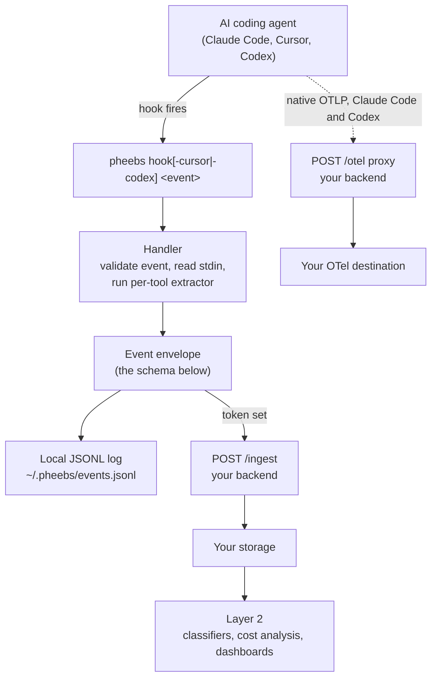

# Architecture

How an agent event becomes a row you can query, and where your own code plugs in.

## The pipeline



Local logging always happens. The `/ingest` send is skipped entirely when no
endpoint and token are configured, which is the default: Pheebs ships local-only.

## The client's job, and where it stops

Pheebs emits generic facts about an interaction: a tool ran with intent
`test_run`, a VCS write action of kind `commit` happened, a session started.
Each is stamped with `session_id`, `developer`, `codebase`, `ai_tool`, and
`timestamp`.

It does not correlate events. Hooks are stateless single-shot processes, so a
hook invocation cannot know what happened earlier in the session. Correlation
is the consumer's job, and that boundary is deliberate: it keeps the event
schema unopinionated and lets any number of consumers compose the same facts
differently.

The rule that follows: Pheebs never emits goal-shaped metrics. No
`tier_3_detected`, no scores, no verdicts. It emits facts; a consumer composes
them.

## The event envelope

Every event, from every tool, has the same base shape:

```json
{
  "timestamp": "2026-03-13T14:30:00.000Z",
  "source": "hook",
  "event": "context_compacted",
  "developer": "octocat",
  "codebase": "Eversynced/pheebs",
  "ai_tool": "claude_code",
  "session_id": "abc123",
  "trigger_type": "auto"
}
```

The typed fields are `timestamp, source, event, developer, codebase, ai_tool,
session_id, version`. Everything tool-specific or event-specific rides alongside
them as extras: `tool_intent`, `vcs_action`, `command_name`, `lines_changed`,
`agent_type`, and so on. `ai_tool` says which agent produced the event.

`developer` is stripped by the client before the send. The backend stamps
identity from the token instead, so the transport never carries a claimed
identity.

## The contract

[`openapi.yaml`](../openapi.yaml) at the repo root is the normative description
of the routes a backend must implement. [`backend-contract.md`](./backend-contract.md)
carries the failure semantics and the reasoning that a schema cannot express:
what a 4xx means, what is optional, what a compliant implementation may not do.

Read them together. The spec says what the shapes are; the contract doc says
what the behavior must be. A runnable implementation of both lives in
[`examples/backend-node/`](../examples/backend-node/).

## Where Layer 2 plugs in

Anything that scores, classifies, costs, or ranks is Layer 2: a consumer of the
contract, never a driver of the schema. It reads the stored events and composes
them. A field that only makes sense to one consumer's scoring model does not
belong in an event.

Two integration points exist for consumers that need more than stored rows:

- **`/classify-prompt`**, an optional backend route. When tenant consent is
  present, the client sends the raw prompt and attaches the returned
  `prompt_intent` to the event. It is best-effort and bounded: it degrades to
  `prompt_intent: "unclassified"`, sends no prompt text on failure, and never
  blocks the hook.
- **`/insights`**, an optional backend route for a consumer that computes
  cost, repertoire, or quality sections over the stored events.

Both are described in [`backend-contract.md`](./backend-contract.md).

## Composing events into metrics

Consumer-side correlation has a few rules that are properties of the capture
layer, not preferences. They apply to any storage engine.

**Anchor on `tool_use_completed` and `tool_use_failed`, never `tool_invoked`.**
Cursor and Codex fire `tool_invoked` for the same execution that later produces
a completion event, so including it double-counts.

**Pass and fail are uniform across all three tools.** Claude Code and Cursor
fire `tool_use_failed` on a failed call and `tool_use_completed` on success.
Codex has no failure hook, so the handler derives the outcome from the raw tool
result and rewrites the event to `tool_use_failed`. A `test_run` on
`tool_use_completed` passed; on `tool_use_failed` it failed.

**Correlation never crosses `session_id`.** A test run in one session and a
commit in another are unrelated, and treating them otherwise invents a
sequence that did not happen.

A worked example, a test-gate ratio: for each VCS write action, carry forward
the timestamp of the most recent passing test run in the same session, and call
the action gated when one falls inside a short preceding window.

```sql
WITH stream AS (
  SELECT
    session_id, developer, codebase, ai_tool,
    timestamp::timestamptz AS ts,
    event,
    extras->>'tool_intent' AS intent,
    extras->>'vcs_action'  AS vcs_action
  FROM events
  WHERE event IN ('tool_use_completed', 'tool_use_failed')
    AND extras->>'tool_intent' IN ('test_run', 'vcs')
),
tagged AS (
  SELECT *,
    max(ts) FILTER (WHERE intent = 'test_run' AND event = 'tool_use_completed')
      OVER (PARTITION BY session_id ORDER BY ts
            ROWS BETWEEN UNBOUNDED PRECEDING AND CURRENT ROW) AS last_pass_ts
  FROM stream
)
SELECT
  session_id, developer, ts AS vcs_ts, vcs_action,
  (last_pass_ts IS NOT NULL
   AND ts - last_pass_ts <= interval '10 minutes') AS test_gated
FROM tagged
WHERE intent = 'vcs'
  AND vcs_action IN ('commit', 'push', 'pr_create')
  AND event = 'tool_use_completed';
```

The same window-function shape derives fix loops (a failing test run, then an
edit, then a passing test run in one session) by carrying forward two
timestamps instead of one.

### What limits these metrics

- **The time window is a heuristic.** Ten minutes is a guess at "this test run
  belongs to this change". Widen it for slow suites, narrow it to reduce
  coincidental pairings.
- **Chained commands resolve to their strongest write action.**
  `git add -A && git commit && git push` reports `push`. A VCS command behind a
  non-VCS leading token, such as `cd sub && git commit`, classifies as
  `tool_intent = other` upstream and never reaches the metric. That is a known
  limitation of leading-token intent classification.
- **Codex outcome coverage is a lower bound.** Codex `PostToolUse` intercepts
  simple shell calls only, not `unified_exec` and not non-shell tools. Failures
  on uninstrumented calls never reach a hook. Claude Code and Cursor emit a
  dedicated failure event and are not subject to this gap.
- **Some fields are absent rather than zero.** `lines_changed` stays unset when
  the shape is unrecognized, and `rule_attachment_count` is omitted for a
  rule-less list, because a `0` would be indistinguishable from a surface that
  does not populate the field. Treat absent and zero as different.

Findings of this kind are recorded in
[`spike-findings-ledger.md`](./spike-findings-ledger.md) as they are verified.
